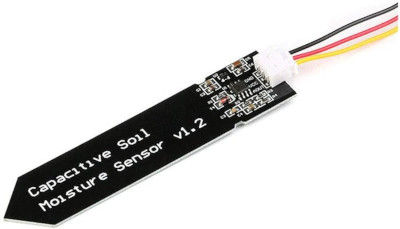

# Swift Zigbee Soil Moisture Sensor

This hardware project is about creating a Zigbee adapter to the existing Capacitive Soil Moisture Sensor 1.2 widely available.

## How to use it

[Here is](doc/Swift%20Zigbee%20Soil%20Moisture%20Sensor.pdf) the small user manual.

It works well with Conbee2 and SONOFF zigbee concentrators used with Home Assistant.

CR2032 coin battery should allow approximately two years of autonomy.

## Technical background

After some trials on STM32WB55 which permanently failed to connect to a zigbee concentrator (Conbee2) I finally chose the nrf52840 SOC from Nordic Semicondudtors. It is very well known in the BLE world and decided to test its Zigbee capabilities and it was successful. Best solutions are provided by Texas Instrument (CC2350) and Silabs (EFR32MG1) at the moment. Using nrf52840 for Zigbee is the challenge here.

The solution is based on ZephyrOS and NRF Connect SDK version 2.6.1 that includes ZBoss proprietary Zigbee stack. One of the challenging aspect of this project is the power consumption. The nrf52840 is able to enter deep sleep and only consumes 2.5µA approximately. Now I had to face that the Capacitive Sensor is based on a NE555. Surprisingly it is not the CMOS version and is supposed to be power supplied between 5 and 15V. But it can be with only 3.3V. Any attempt to power supply below this value resulted in unstable sensor. So I decided to use 3.3V for the whole device (MCU+sensor). This led to choosing a boost converter so a coin battery can be used, ideally CR2032.

The average current measurement is about 10µA, which should allow 2 year autonomy. Probe measurement is done every 30 minutes. When it occurs, the tiny LED lits.

The project was developed thanks to [nRF52840 DK board](doc/nRF52840_DK_User_Guide_v1.2.pdf). I used the OB JLink capability to flash the target board.

The nRF52840 module (E73-2G4M08S1C) comes from EBYTE. It doesn't have the external 32kHz crystal, but this one isn't useful for Zigbee applications.

Documentation folder includes:

- [Electronic schematics](doc/schematics-2.0.pdf)
- Main components datasheet (nrf52840 and tps61097a)
- [How to build and flash](doc/how_to_compile.md)

CAD folder includes:

- [KiCAD](cad/KiCAD) project files
- [FreeCAD](cad/FreeCAD) projet, a desparate attempt to designing a [box](cad/FreeCAD/box.stl)

## Project details

### Building system

The ZephyrOS ecosystem provides high level build system called _west_. It's a pile of Python scripts that doesn't do much else than invoking _cmake_. I quickly realized that cmake can be used solely without the cumbersome _west_ layer. I ended up with a simple Makefile to achieve the bare necessities. 

Forgot to say that I use Linux (Ubuntu or Debian), but this should work well with MacOSX either. I struggled to make Nordic tools to run on Ubuntu 24.04 (app images need to run without sandbox), but this is definitely possible.

Before compiling, ensure to run shell that sets environment variables properly. This tiny shell can be generated by SDK Management Tool.

Building for target is building for production. Use make _clean_, _prod_ and _flash_prod_ for final hardware.

Building for developement on DK is done with a simple 'make' and 'make flash'. In this configuration, serial line is used for message printing and measurement is performed every minute (see _prj.conf_ file).

### Zigbee part

Since it's a soil moisture sensor the device exposes a standard profile from ZHA. I added the battery profile to monitor the coin battery health. These two profiles are installed in main.c file. I crafted a derived battery profile structure myself (ZB_ZCL_DECLARE_POWER_CONFIG_ATTRIB_LIST2), because the predefined ones were either thick or missing additional definitions. Some missing stuff in ZBoss library. Since these structures are built with macros, it wasn't hard to build a more suitable one.

The device is a **Sleepy End Device** (SED), so it doesn't contribute to Zigbee network activities, it just reports periodically attributes.
Low power management was actually easy to do, the nrf52840 is very convenient for this. Choose the SDK wisely, the one that actually worked well for low power is SDK 2.6.1. Older ones resulted in 700µA consumption while asleep. This was way too far from promising 2µA or so. With SDK 2.6.1 the module only consumes 2.3µA when entering deep sleep.

Setting up a SED consists in calling '_zigbee_configure_sleepy_behavior(true)_' and '_power_down_unused_ram()_' at start up. The project configuration file (prj_power_saving.conf) contains:
- CONFIG_ZIGBEE_ROLE_END_DEVICE=y
- CONFIG_RAM_POWER_DOWN_LIBRARY=y

directives for that purpose.

The most tricky part of the code lies in Zigbee event management especially when joining or leaving a network. It also deals with factory reset.

Long poll interval is adjusted to 2 minutes instead of default 7 seconds. This drastically reduces average consumption. More than 2 minutes resulted in rejoin procedure failure or reparenting failure in the mesh. That caused headaches. My opinion is that this part is the weak one of ZBoss stack (also used with ESP32 systems). That's where Silabs and Texas Instrument are still leading the Zigbee field.

### I/O

Two analog inputs are setup, one for probe and one to measure battery voltage. Due to E73 module pinout, peculiar pins were chosen so they are accessible among the castled ones.

The probe uses 10mA to make a humidity measurement. So it is driven by a MOSFET controlled by a GPIO. The probe is therefore powered when used. A serie of measurements are done in a loop until stable.

A led is useful with embedded devices. The one on this board reflects pairing process status and measurement operation.

As mentioned, the 32kHz external crystal is not used, saving some components. It is not needed for Zigbee because clock precision isn't required here. But, it is necessary to add the two following defines in project file:
- CONFIG_CLOCK_CONTROL_NRF_K32SRC_RC=y
- CONFIG_CLOCK_CONTROL_NRF_K32SRC_XTAL=n

This tells bootloader not to use internal 32kHz clock and not to calibrate it. Otherwise MCU won't boot stuck in calibration loop.

Using the internal 32kHz clock didn't result in extra consumption.

### Hardware part

As mentionned earlier, the external probe needs at least 3.3V. The nrf52840 usually runs at 3V (usual coin battery voltage), but supports up to 3.7V. I had to find a boost IC with low quiescent current so I can use a 3V battery and power supplies the external probe. Best choice so far is a TPS 61097a from Texas Instrument (TPS 61121 worked well either, but was twice as much more expensive).

### Measurement

The measurement operation occurs every 30 minutes. This is configured in _Kconfig_ file. An hour should suffice actually and save more power.

A low filter is applied on subsequent measures. It might be too strong and should be reduced.