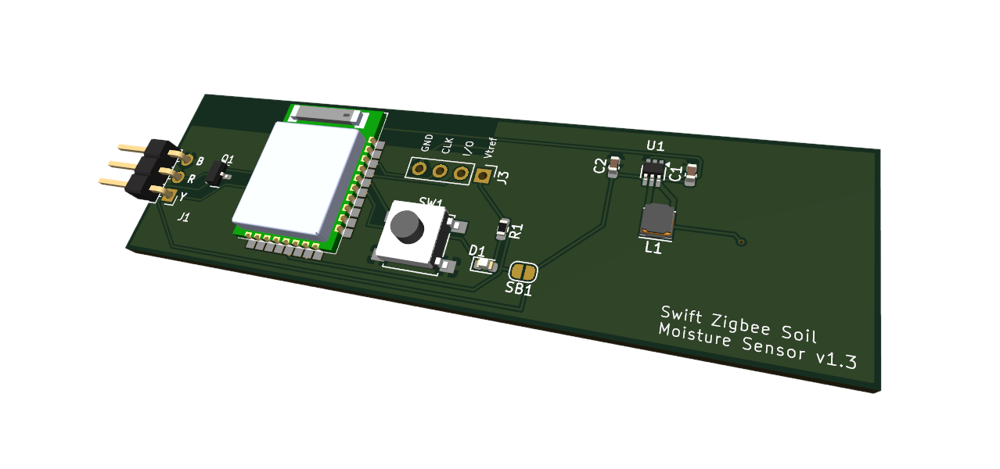

# Swift Zigbee Soil Moisture Sensor

This hardware project is about creating a Zigbee adapter to the existing Capacitive Soil Moisture Sensor 1.2 widely available.

After some trials on STM32WB55 which permanently failed to connect to a zigbee concentrator (Conbee2) I finally chose the nrf52840 SOC from Nordic Semicondudtors. It is very well known in the BLE world and decided to test its Zigbee capabilities and it was successful.

The solution is based on ZephyrOS and NRF Connect SDK version 2.6.1. One of the challenging aspect of this project is the power consumption. The nrf52840 is able to enter deep sleep and only consumes 2.5µA approximately. Now I had to face that the Capacitive Sensor is based on NE555. Surprisingly it is not the CMOS version and is supposed to be supplied between 5 and 15V. But it can be power supplied with 3.3V. Any attempt to power supply below this value resulted in unstable sensor. So I decided to use 3.3V for the whole device (MCU+sensor). This led to choosing a boost converter so a coin battery can be used, ideally CR2032.
